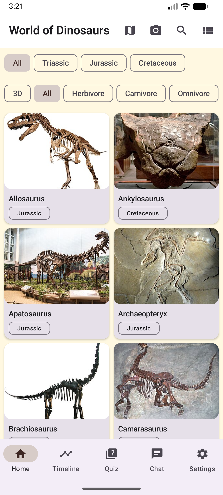
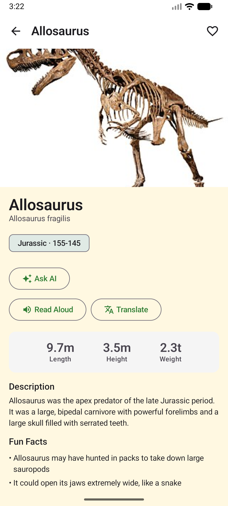
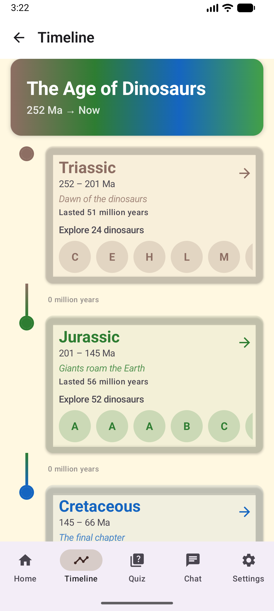
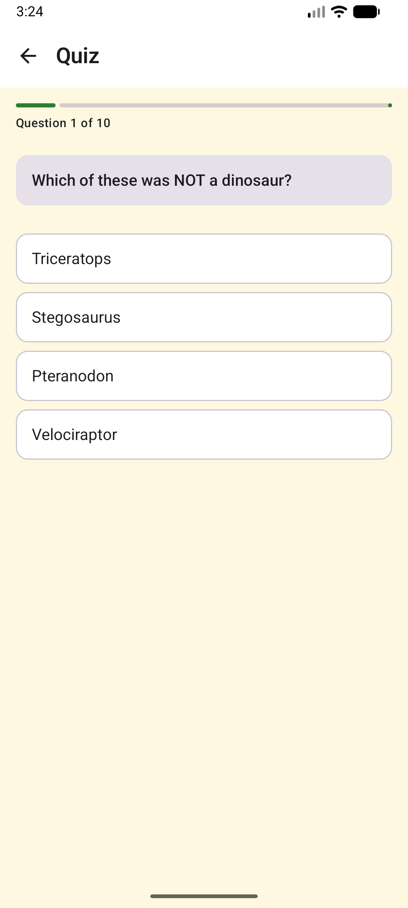
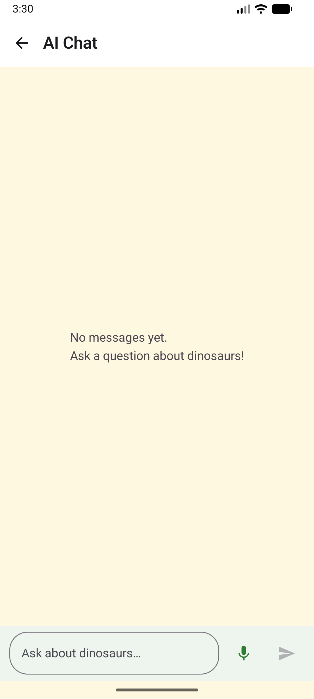
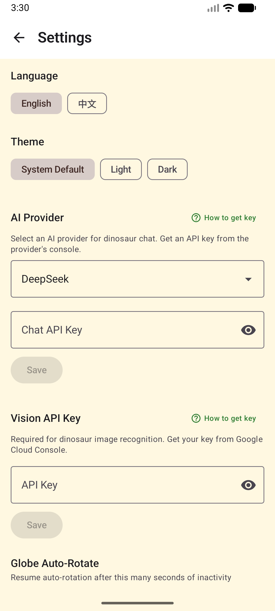

# World of Dinosaurs

An interactive dinosaur encyclopedia for Android, built with Jetpack Compose and Material 3.

Explore 230+ dinosaur species with 3D models, AR viewing, AI chat, quizzes, and more — in English and Chinese.

## Features

- **Dinosaur Encyclopedia** — Browse 230+ species with descriptions, stats, fun facts, and discovery info
- **3D Models & AR** — View dinosaurs in 3D or place them in your room with Augmented Reality (ARCore)
- **AI Chat** — Ask questions about dinosaurs using DeepSeek, Qwen, Gemini, or custom LLM providers
- **Timeline** — Visual journey from the Triassic (252 Ma) through the K-Pg extinction to today
- **Discovery Map** — Interactive globe showing where fossils were found (OSMDroid + globe.gl)
- **Quizzes** — Test your knowledge with randomized questions and score tracking
- **Image Recognition** — Point your camera at a dinosaur image and identify the species (Google Vision API)
- **QR Code Scanner** — Scan QR codes to unlock dinosaur details
- **Text-to-Speech** — Listen to descriptions read aloud in English or Chinese
- **Bilingual** — Full English and Chinese (中文) support with in-app translation toggle
- **Favorites** — Save and manage your favorite dinosaurs
- **Dark Mode** — System, light, and dark theme options

## Screenshots

| Home | Detail | Timeline | Quiz |
|:----:|:------:|:--------:|:----:|
|  |  |  |  |

| AI Chat | Settings |
|:-------:|:--------:|
|  |  |

## Tech Stack

| Layer | Technology |
|-------|-----------|
| Language | Kotlin |
| UI | Jetpack Compose + Material 3 |
| Architecture | MVVM + Clean Architecture |
| DI | Hilt |
| Database | Room |
| Network | Retrofit + Moshi |
| Image Loading | Coil |
| Settings | DataStore Preferences |
| 3D / AR | SceneView + ARCore |
| Maps | OSMDroid (OpenStreetMap) |
| Camera | CameraX + ML Kit (barcode) |
| AI | OpenAI-compatible Chat API (DeepSeek / Qwen / Gemini) |
| Vision | Google Cloud Vision API |
| TTS | Android TextToSpeech |
| Ads | Google AdMob |
| Build | Gradle KTS + KSP |

## Getting Started

### Prerequisites

- Android Studio Hedgehog (2023.1) or later
- JDK 17
- Android SDK 35 (compile) / 26 (min)

### Build

```bash
git clone https://github.com/tgut/world_of_dinosaurs.git
cd world_of_dinosaurs
./gradlew assembleDebug
```

### Configuration (optional)

Create `keystore.properties` in the project root for release signing:

```properties
storeFile=path/to/your.jks
storePassword=yourpassword
keyAlias=youralias
keyPassword=yourkeypassword
```

AI and Vision features require API keys — configure them in **Settings** within the app.

## Project Structure

```
app/src/main/java/com/example/world_of_dinosaurs_extented/
├── DinoApp.kt              # Application entry point
├── MainActivity.kt         # Single Activity
├── navigation/             # Navigation graph
├── di/                     # Hilt modules
├── domain/                 # Business layer (models, use cases, repository interfaces)
├── data/                   # Data layer (API, Room, JSON, settings, TTS, ads)
└── ui/                     # UI layer (screens, view models, composables)
    ├── home/               #   Home (dinosaur list + globe)
    ├── detail/             #   Dinosaur detail (stats, TTS, translate, banner ad)
    ├── favorites/          #   Favorites
    ├── quiz/               #   Quiz (rewarded ad to unlock explanations)
    ├── timeline/           #   Timeline (Triassic → extinction → today)
    ├── chat/               #   AI chat (text + voice input)
    ├── map/                #   Discovery map
    ├── model3d/            #   3D viewer / AR
    ├── qrscan/             #   QR scanner
    ├── recognition/        #   Image recognition
    └── settings/           #   Settings (language, theme, API keys, donate, feedback)
```

## Privacy Policy

[Read the full Privacy Policy](PRIVACY_POLICY.md)

## License

This project is for educational purposes.

## Contact

- GitHub Issues: [github.com/tgut/world_of_dinosaurs/issues](https://github.com/tgut/world_of_dinosaurs/issues)
