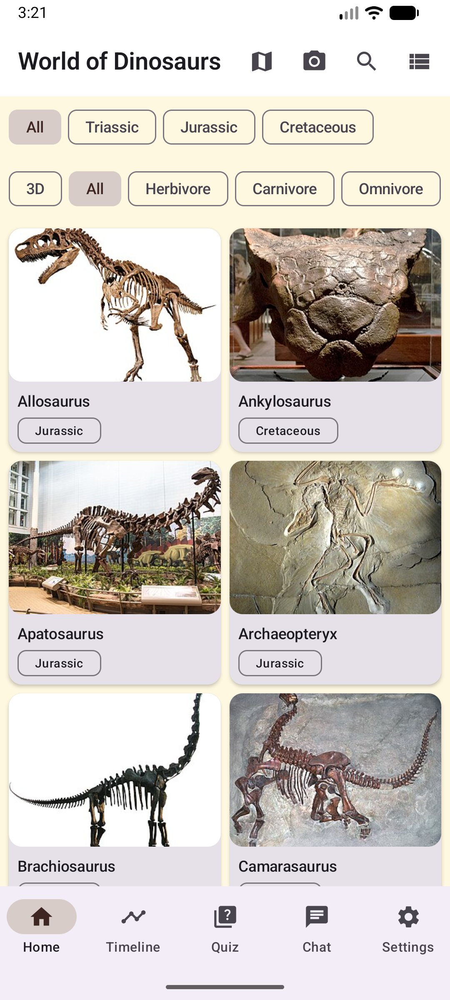
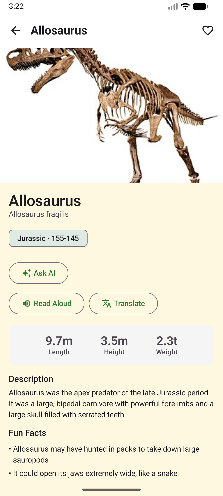
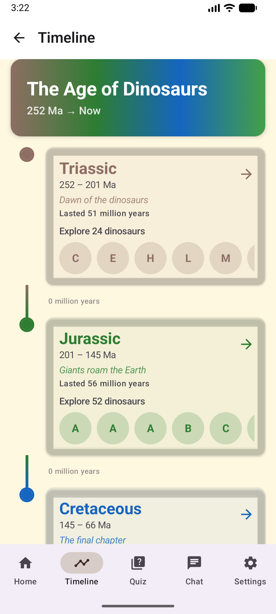
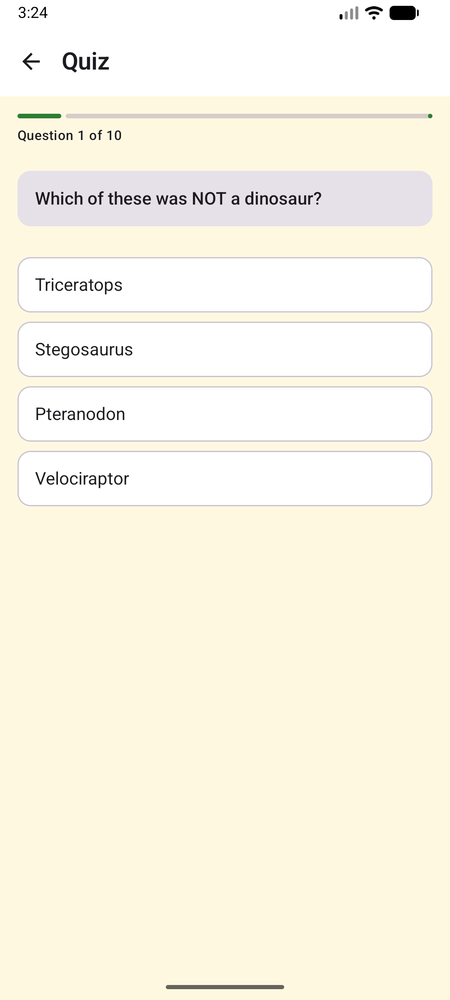
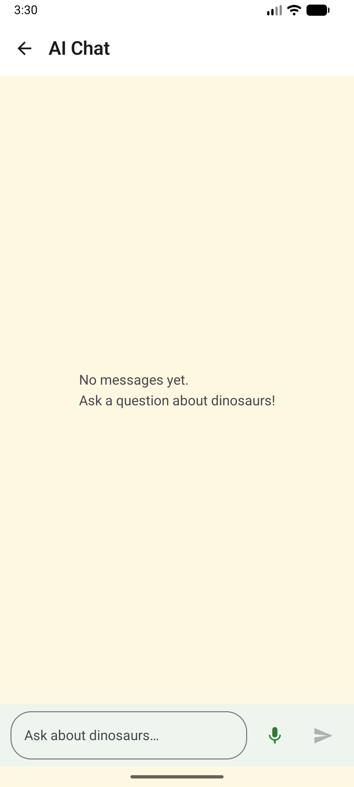
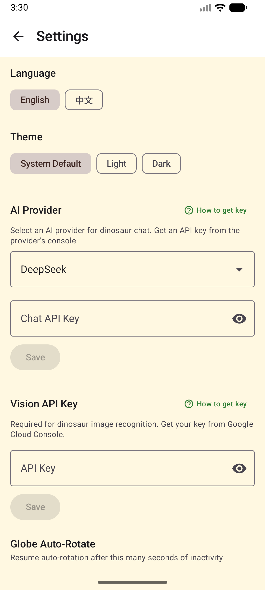

# World of Dinosaurs

An interactive dinosaur encyclopedia for Android, built with Jetpack Compose and Material 3.

Explore 230+ dinosaur species with 3D models, AR viewing, AI chat, quizzes, and more — in English and Chinese.  
**Dual-market compatible**: runs on both Google Play and Huawei AppGallery (CN & overseas).

## Features

- **Dinosaur Encyclopedia** — Browse 230+ species with descriptions, stats, fun facts, and discovery info
- **3D Models & AR** — View dinosaurs in 3D or place them in your room with Augmented Reality (ARCore / AR Engine)
- **AI Chat** — Ask questions about dinosaurs using DeepSeek, Qwen, Gemini, or custom LLM providers
- **Timeline** — Visual journey from the Triassic (252 Ma) through the K-Pg extinction to today
- **Discovery Map** — Interactive globe + 2D map showing where fossils were found  
  ↳ **Auto-switches** between OSM France (overseas) and Tencent Maps (China)
- **Quizzes** — Test your knowledge with randomized questions and score tracking
- **Image Recognition** — Point your camera at a dinosaur image to identify the species  
  ↳ **Auto-switches** between Google Vision (overseas) and Tencent Cloud Vision (China)
- **QR Code Scanner** — Scan QR codes to unlock dinosaur details
- **Text-to-Speech** — Listen to descriptions read aloud in English or Chinese
- **Bilingual** — Full English and Chinese (中文) support with in-app translation toggle
- **Favorites** — Save and filter your favorite dinosaurs; per-user scoped when logged in
- **User Login** — Sign in with Huawei Account Kit (AppGallery flavor) or local login (Google flavor)
- **Chat History** — AI chat sessions and messages are persisted in the local database
- **Data Export** — Export your favorites to a JSON file and share it via any app
- **Dark Mode** — System, light, and dark theme options

## Screenshots

| Home | Detail | Timeline | Quiz |
|:----:|:------:|:--------:|:----:|
|  |  |  |  |

| AI Chat | Settings |
|:-------:|:--------:|
|  |  |

## Tech Stack

| Layer | Technology |
|-------|-----------|
| Language | Kotlin |
| UI | Jetpack Compose + Material 3 |
| Architecture | MVVM + Clean Architecture |
| DI | Hilt |
| Database | Room |
| Network | Retrofit + Moshi |
| Image Loading | Coil (memory + disk cache) |
| Settings | DataStore Preferences |
| 3D / AR | SceneView + ARCore (Google) / AR Engine (Huawei) |
| Maps | OSMDroid (OSM) + Tencent Maps (China) |
| Camera | CameraX + ML Kit barcode (Google) / Scan Kit (Huawei) |
| AI | OpenAI-compatible Chat API (DeepSeek / Qwen / Gemini) |
| Vision | Google Cloud Vision + Tencent Cloud Vision (auto-detect) |
| Auth | Huawei Account Kit (AppGallery) |
| Database Migration | Room with manual migrations (v1 → v5) |
| TTS | Android TextToSpeech |
| Ads | Google AdMob (Google) / HMS Ads Kit (Huawei) |
| Build | Gradle KTS + KSP |
| Flavors | `google` (GMS) / `huawei` (HMS) |

## Getting Started

### Prerequisites

- Android Studio Hedgehog (2023.1) or later
- JDK 17
- Android SDK 35 (compile) / 26 (min)

### Build

```bash
git clone https://github.com/tgut/world_of_dinosaurs.git
cd world_of_dinosaurs

# Build Google flavor (GMS — for Google Play)
./gradlew assembleGoogleDebug

# Build Huawei flavor (HMS — for Huawei AppGallery)
./gradlew assembleHuaweiDebug
```

### Configuration (optional)

Create `keystore.properties` in the project root for release signing:

```properties
storeFile=path/to/your.jks
storePassword=yourpassword
keyAlias=youralias
keyPassword=yourkeypassword
```

On CI, signing config is supplied via environment variables (`STOREFILE`, `KEYALIAS`, `KEYPASSWORD`, `STOREPASSWORD`) — see `.github/workflows/release.yml`.

**Required API keys** (configure in-app under Settings → Services):

| Service | Required for | Get it at |
|---------|-------------|-----------|
| Google Vision | Image recognition (overseas) | [console.cloud.google.com](https://console.cloud.google.com/) |
| Tencent Cloud Vision | Image recognition (China) | [console.cloud.tencent.com](https://console.cloud.tencent.com/) |
| Tencent Maps | Map tiles (China) | [lbs.qq.com](https://lbs.qq.com/) |
| AI Chat (DeepSeek/Qwen/Gemini) | AI dinosaur chat | Provider's console |

### Huawei AppGallery Setup

1. Download `agconnect-services.json` from [AppGallery Connect](https://developer.huawei.com/consumer/cn/) and place it in `app/`
2. Configure SHA-256 certificate fingerprint in AppGallery → Project → App Info
3. Enable **Account Kit** in AppGallery → Project → API Management

## Project Structure

```
app/src/
├── main/java/com/example/world_of_dinosaurs_extented/
│   ├── DinoApp.kt              # Application entry point (Coil cache config)
│   ├── MainActivity.kt         # Single Activity
│   ├── navigation/             # Navigation graph + route definitions
│   ├── di/                     # Hilt modules (Network, Database, App)
│   ├── domain/                 # Business layer
│   │   ├── model/              #   User, Dinosaur, QuizQuestion, etc.
│   │   ├── repository/         #   Repository interfaces
│   │   └── usecase/            #   Use cases (export, login, toggle fav, etc.)
│   ├── data/                   # Data layer
│   │   ├── local/              #   Room DB, DAOs, entities, migrations
│   │   ├── remote/             #   Retrofit API services + DTOs
│   │   ├── map/                #   Coordinate converter, tile sources, MapProvider
│   │   ├── repository/         #   Repository implementations
│   │   └── SettingsManager.kt  #   DataStore preferences
│   └── ui/                     # UI layer
│       ├── home/               #   Home (dino list/grid, FAB speed dial)
│       ├── detail/             #   Dinosaur detail (stats, TTS, banner ad)
│       ├── favorites/          #   Favorites list
│       ├── quiz/               #   Quiz (rewarded ad to unlock)
│       ├── timeline/           #   Geological timeline
│       ├── chat/               #   AI chat (text input, history)
│       ├── map/                #   Discovery map (OSM / Tencent)
│       ├── model3d/            #   3D viewer / AR
│       ├── qrscan/             #   QR code scanner
│       ├── recognition/        #   Camera-based image recognition
│       ├── auth/               #   Login, user profile
│       └── settings/           #   Categorized settings pages
├── google/                     # Google flavor (AdMob, ARCore, ML Kit, Google Sign-In)
│   └── java/.../
│       ├── di/                 #   ARModule, AdModule, AuthModule
│       ├── data/ads/           #   AdMobAdManager
│       └── ui/auth/            #   LoginIntentProviderImpl (no-op)
└── huawei/                     # Huawei flavor (HMS Ads, AR Engine, Scan Kit)
    └── java/.../
        ├── di/                 #   AdModule, AuthModule
        ├── data/ads/           #   HmsAdManager
        ├── data/remote/        #   HuaweiAccountManager
        └── ui/auth/            #   LoginIntentProviderImpl (Huawei Account Kit)
```

## Privacy Policy

[Read the full Privacy Policy](PRIVACY_POLICY.md)

## License

This project is for educational purposes.

## Changelog

### v1.2.6 (2026-07-19)

- **Home UI**: favorites filter + grid/list toggle moved to bottom-right FAB speed dial
- **Image loading**: All 186 dinosaur images use local `asset:///` URLs — instant load in China, no more wikimedia.org timeouts
- **Coil cache**: Added memory (25%) + disk (50MB) cache
- **Data export**: Export favorites to JSON file + Share Sheet in Settings → Data Management
- **Settings**: Reorganized into categorized pages (Appearance / Chat / Services / Interaction / Data / About)

### v1.2.5 (2026-07-15)

- **Login flow**: Google flavor "Sign In" button works end-to-end, auto-navigates back on success
- **Fix**: `LoginIntentProvider` binding added to both flavor AuthModules for Hilt injection

### v1.2.4 (2026-07-14)

- **Login features**: Huawei Account Kit integration with dedicated huawei-sourceset DI
- **User-scoped data**: Favorites + scan history scoped to `userId` (Room DB schema v4→v5 migration)
- **Chat history**: New `chat_sessions` + `chat_messages` Room tables for future chat persistence

### v1.2.3 — v1.2.2 (2026-07-12)

- **Chinese market compatibility**: Dual map (OSM/腾讯) + Vision (Google/腾讯云) with auto-detection
- **Map**: Tencent Maps tile source with WGS-84 ↔ GCJ-02 coordinate conversion
- **Vision**: Tencent Cloud Vision API with TC3-HMAC-SHA256 signing, abstract `VisionService` interface
- **Auth**: Huawei Account Kit login, flavor-aware `LoginIntentProvider` (Google = no-op, Huawei = HKIT)

## Contact

- GitHub Issues: [github.com/tgut/world_of_dinosaurs/issues](https://github.com/tgut/world_of_dinosaurs/issues)
